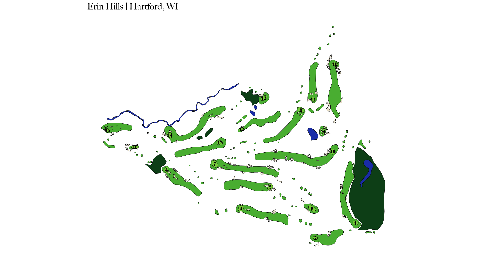

# golfMapsR

Welcome to <strong>golfMapsR</strong>, an R package for working with and visualizing geospatial golf course data. The data is made up of golf course polygons (greens, fairways, tee boxes, bunkers, hazards, etc), sourced from Google Earth and OpenStreetMap.

<p align="center">
  
&nbsp; &nbsp; &nbsp; &nbsp;
  
</p>

## Installation:
You can install golfMapsR from my GitHub:
```r
# install.packages("devtools")
devtools::install_github("abodesy14/golfMapsR")
library(golfMapsR)
```

## Functions:
Functions:

- ```get_plotted_courses()``` : Start here to get a list of plotted courses. The returned table includes an api_id for each course, which can be used as inputs to the other functions for retrieving or plotting specific courses.
- ```get_polygon_data(api_id)``` : Retrieves polygon level data for a given golf course. This returns an sf object with the type of polygon, square footage of the polygon, the course, hole number, distance to the green from each polygon, etc. The distance calculation is math-based and uses a “as the crow flies” method (straight line distance between centroids). Metrics such as average green size and number of bunkers can be calculated from this data.
- ```plot_course(api_id)``` : Plots a full golf course for the api_id supplied. Future enhancements may include color customization options.
- ```plot_hole(api_id, hole_number)``` : Plots single hole for specified course.

## Data and Contributing:
The geospatial data comes from manually traced KML files in Google Earth. It can be a time-intensive process, but one that produces highly detailed visuals. If you have any questions or interest in contributing, feel free to reach out to me at adam.c.beaudet@gmail.com or make a PR.

## Shiny App:
You can interact with my Shiny app here to see which courses have been mapped: https://abodesy14.shinyapps.io/golfMapsR/

## Article:
For more backstory on the project, you can view my article here: https://medium.com/towards-data-science/plotting-golf-courses-in-r-with-google-earth-8ee8aa6f6293
