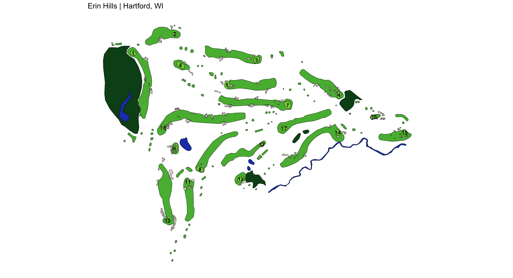

# golfMapsR

Welcome to the <strong>golfMapsR</strong>, a repository dedicated to mapping golf courses using geographic data. Each golf course in this repo has been traced in Google Earth to capture various course elements such as tee boxes, fairways, bunkers, greens, and hazards. These detailed polygon outlines are saved as KML files to be read into R and plotted with ggplot2. 

  
&nbsp; &nbsp; &nbsp; &nbsp;
  

## Usage
To get started, clone this repo and use the <strong>generate_map.R</strong> script, or navigate to the Shiny app to see which courses have been mapped: https://abodesy14.shinyapps.io/golfMapsR/ 

## Contributing
Use the <strong>Issues</strong> template to request a new course mapping. 

<strong>Disclaimer</strong>: The process of mapping golf courses in its current state can be time consuming. With some combined effort, a nice database of plottable golf courses can be created. I myself don't have the bandwith to scale this repo at large, so if you have any interest in contributing to this project, please feel free to clone/fork and create a PR. I can also be reached at adam.c.beaudet@gmail.com.

## Future Roadmap
<li>Layer individual shots on top of maps programatically with Plotly</li>
<li>Calculate area of polygon types for each course - this opens the door for course to course comparisons, such as: average green size, number of bunkers, average fairway size, amount of water/hazards, etc.</li>
<li>Create R package</li>
<li>Shiny App</li>
